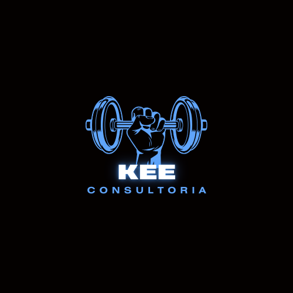

# KeeGym - Sua Plataforma de Consultoria em Fitness



Bem-vindo ao KeeGym, sua plataforma de consultoria em fitness onde transformamos seus objetivos em realidade!

## Sobre o KeeGym

O KeeGym é a solução definitiva para aqueles que desejam alcançar resultados reais em sua jornada fitness. Seja você um iniciante na academia ou um atleta experiente, nossa plataforma oferece tudo o que você precisa para alcançar seus objetivos de saúde e fitness.

## Recursos Principais

- **Treinos Personalizados**: Nossos treinadores especializados criam programas de treino adaptados às suas necessidades e metas específicas.
- **Dietas Sob Medida**: Desfrute de planos de alimentação personalizados, equilibrados e adaptados ao seu estilo de vida e objetivos de saúde.

- **Suporte Especializado**: Conte com o apoio contínuo de nossa equipe de especialistas em fitness para orientação e motivação ao longo de sua jornada.

- **Flexibilidade**: Nossos treinos podem ser realizados em qualquer academia, com exercícios simples e eficazes para ajudá-lo a alcançar seus objetivos onde quer que esteja.

## Como Começar

1. Acesse nossa plataforma online em [KeeGym](https://kee-gym.vercel.app/).

2. Crie sua conta gratuita e preencha seu perfil com informações sobre seus objetivos de fitness.

3. Explore nossos recursos e comece sua jornada de transformação hoje mesmo!

## Vantagens do KeeGym

- **Personalização Total**: Cada plano é adaptado exclusivamente para você, garantindo resultados eficazes e duradouros.
- **Apoio Constante**: Estamos aqui para ajudá-lo em cada etapa do caminho, fornecendo orientação especializada e motivação contínua.

- **Facilidade de Uso**: Nossa plataforma é intuitiva e fácil de navegar, permitindo que você se concentre no que realmente importa: alcançar seus objetivos de fitness.

## Rodando o Projeto Localmente

Para rodar o projeto localmente em sua máquina, siga estas etapas:

1. Clone este repositório em sua máquina local:

   ```bash
   git clone https://github.com/VictorRibeiroH/keeGYM
   ```

2. Navegue até o diretório do projeto:

   ```bash
   cd keegym
   ```

3. Instale as dependências usando npm ou yarn:

   ```bash
   npm install
   # ou
   yarn install
   ```

4. Após a instalação das dependências, você pode iniciar o servidor de desenvolvimento:

   ```bash
   npm run dev
   # ou
   yarn dev
   ```

5. O projeto estará acessível em seu navegador em [http://localhost:5173](http://localhost:5173).

## Visualize o Projeto Online

Você também pode acessar a versão online do KeeGym em https://kee-gym.vercel.app/.
